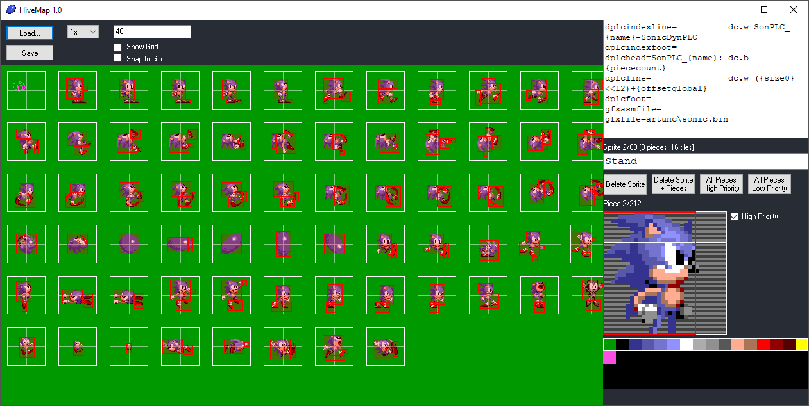

# HiveMap

HiveMap is a sprite mappings editor for Sega Mega Drive games. It takes a PNG spritesheet as its input and is used to create multipiece sprite mappings. Mappings are then stored in an INI file, which can be fed into [HiveMapExport](https://github.com/cvghivebrain/HiveMapExport) to generate Mega Drive compatible graphics and mappings in whatever format the user specified.

## Usage

* Load either an INI or PNG file. If it's a fresh PNG, a new INI file will be automatically generated.
* Right click on the PNG workspace to create a new sprite box centered on the pointer. This can be resized and should contain the whole sprite.
* Right click on the sprite box to create a new piece. This should be fully within the sprite box or it will not be included. Use the menu on the right side of the program to resize the piece. It can be 8, 16, 24 or 32 pixels in width/height. Try to use as few pieces as possible per sprite, while balancing the number of 8x8 tiles used by the sprite. _Sonic the Hedgehog_ for example is limited to 23 tiles for the Sonic character sprite. While more pieces will save on VRAM usage, you risk running into the hardware limit of 80 sprites.
* When a piece is selected, you can change its palette line and priority with the piece menu.
* The palette is generated automatically when the PNG is first loaded by reading pixels left to right, top to bottom. For this reason it is advisible to manually draw the palette on the top-left of the PNG before loading it in HiveMap. You can change individual colours in the palette later on by clicking on the palette menu while no sprites/pieces are selected, and then clicking on a pixel in the image with the crosshair.
* Zoom in/out with the mousewheel or the zoom dropdown menu.

## INI format
### Generated in-program
* `palette=` RGB values separated by commas.
* `sprite=` Sprite name, x position, y position, width, height.
* `piece=` Piece x position, y position, palette line/priority bitfield, size.
* `grid=` Grid setting (default 40). Use single value for square grid, or two values separated by a comma for different width/height.
* `image=` Path to PNG file.

### Files
* `mapasmfile=` Path to mappings file.
* `dplcasmfile=` Path to DPLC file.
* `gfxasmfile=` Path to graphics list file.
* `gfxfile=` Path to graphics binary file(s).
  * `{name}` Sprite name. Omit this to output to a single graphics file.
* `gfxline=` Repeating line in graphics list file.

### Mappings
* `mapindexhead=` First line of mappings index (usually a label).
* `mapindexline=` Repeating line of mappings index.
  * `{name}` Sprite name.
* `mapindexfoot=` Last line of mappings index.
* `maphead=` First line of mappings entry (usually a label and header).
  * `{name}` Sprite name.
  * `{piececount}` Pieces in sprite.
  * `{tilecount}` Tiles in sprite.
  * `{bytecount}` Bytes in sprite.
* `mapline=` Repeating line of mappings entry (piece).
  * `{xpos}` X position.
  * `{ypos}` Y position.
  * `{size}` Piece size (0-15).
  * `{width}` Piece width in tiles (1-4).
  * `{height}` Piece height in tiles (1-4).
  * `{offsetlocal}` Offset within graphics for current sprite.
  * `{offsetglobal}` Offset within all graphics.
  * `{pal}` Palette line (replaced with string from `pal#str=`).
  * `{priority}` Piece priority (replaced with string from `histr=` or `lowstr=`).
* `mapfoot=` Last line of mappings entry.
* `pal1str=` String to insert for palette line 1.
* `pal2str=` String to insert for palette line 2.
* `pal3str=` String to insert for palette line 3.
* `pal4str=` String to insert for palette line 4.
* `histr=` String to insert for high priority piece.
* `lowstr=` String to insert for low priority piece.

### DPLCs
* `dplc=` "yes" for standard DPLCs; "inline" for DPLCs inline with mappings. Assumed to be "yes" if `dplcasmfile=` is set.
* `dplcindexhead=` First line of DPLC index (usually a label).
* `dplcindexline=` Repeating line of DPLC index.
  * `{name}` Sprite name.
* `dplcindexfoot=` Last line of DPLC index.
* `dplchead=` First line of DPLC entry (usually a label and header).
  * `{name}` Sprite name.
  * `{piececount}` Pieces in sprite.
  * `{tilecount}` Tiles in sprite.
  * `{bytecount}` Bytes in sprite.
* `dplcline=` Repeating line of DPLC entry.
  * `{name}` Sprite name.
  * `{size}` Tiles in piece.
  * `{size0}` Tiles in piece, starting from 0 (i.e. 0 = 1 tile).
  * `{tilecount}` Tiles in sprite.
  * `{bytecount}` Bytes in sprite.
  * `{offsetlocal}` Offset within graphics for current sprite.
  * `{offsetglobal}` Offset within all graphics.
* `dplcfoot=` Last line of DPLC entry.

### Other
* `{n}` Starts a new line in the output file.